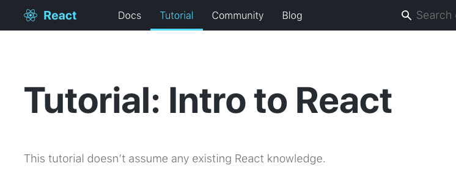
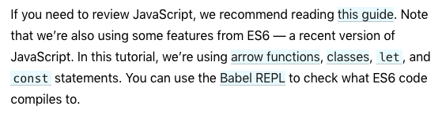
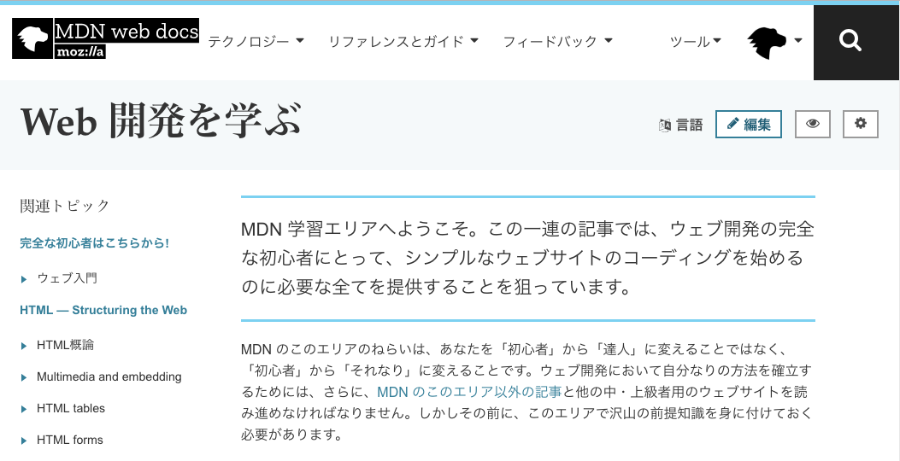
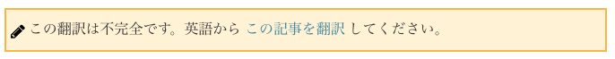
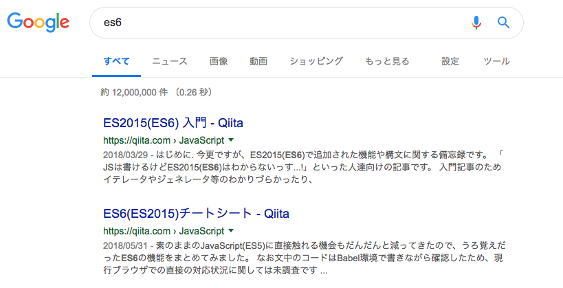
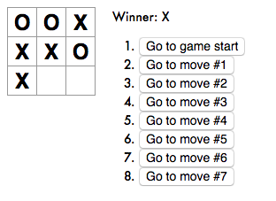
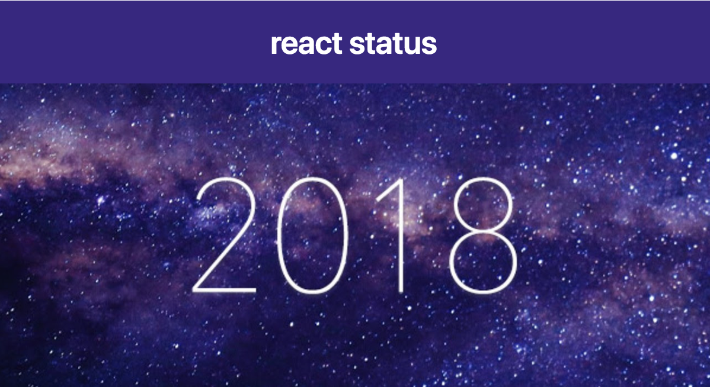
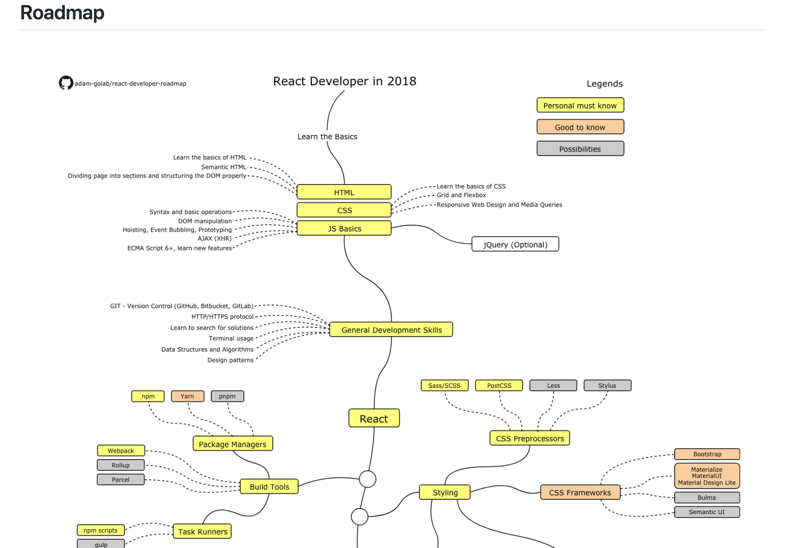

## 1週間でReactに ほぼ0から入門する
@udayan28  
WeJS 2018/12/20

---

### 自己紹介

@snap[west w-center]

@snapend

@snap[east w-70]
@ul
* Webエンジニア@Findy
* できたてホヤホヤエンジニア（1ヶ月弱）
* 本と映画が好き
@ulend
@snapend

---

### 話すこと、話さないこと
- 話すこと
  - どうやってフロントエンドほぼ未経験で React学習までもっていったか
- 話さないこと
  - 技術の細かいところ

---

### 12月某日
- エンジニアになれたし、初心者LT申し込むか！  |
- 抽選だし、当たらない、当たらない！  |

---

## 当たってしまう・・・

---

## 当時の状況
- Webエンジニア歴 2週間  |
- Rails完全に理解した！ （業務で簡単な実装に四苦八苦）  |
- フロントエンドとは？？？(.erbなら見たことある)  |

---

### 「React完全に理解した！」 まで1週間で持っていきたい
（そうしないと発表内容が無い）

---

## やるしかない・・・

---

## なにを？？？

---

### なんとなく聞いたことあるやつ

* HTML5とCSS3？
* JavaScript(ES5以前/ES6移行), TypeScript？？
* React.js、Vue.js？？？(JQuery?)

---

## と、とりあえず、JavaScript！

---

## 本屋に行ってみる
(本が好きなので・・・)

--- 

### 何を購入して良いのか分からず
- Webデザイン系の本が多い・・・  |
- 全体的にちょっと古い・・・  |

--- 

# ググる

---

### ドキュメントがどこにあるのか 分からない
- プログラミングスクールの記事や正確なのか分からない記事がたくさん出てくる・・・  |
- 何が公式ドキュメントなのか・・・  |
- PythonやRubyのように.orgのサイトがない・・・  |

---

## どうしようもないのでReactへ

---

### とりあえずチュートリアル！

---

## ガイドへの誘導を発見！

---

### Mozillaのドキュメントサイト！
- 話題のFirefoxのドキュメントだし、信頼できそう  |
- HTML, CSS, JavaScript全般が学べる  |
- ES6以降の内容も載ってるっぽい！！！  |

---

### これでいいじゃん！

---

### 入り交じる日本語と英語のページ

---

### なんとか入門done

---

### あれ？

---

## ES6は？

- MDN内の初心者ページには見つけられず・・・  |

---

# ググる

---

### ありがとうございます！

---

### Reactで多用されるものをざっと読む

- let, const  |
- アロー関数  |
- Class  |
- その他も軽く頭に入れておく  |

---

### 準備は整った！

---

### いざReactチュートリアルへ！

---

### な、なんとなく分かるぞ！
- JSX（JSに全部突っ込んだやつ）
- Compornent (部品)
- props（投げるやつ）
- state（投げるやつに入ってるやつ）

---

### チュートリアルdone

---

# React完全に理解した！

---

## 0からReactへ入門するための道筋

- MDNのサイト、Web入門を読む |
- Qiita等でES6以降のJS知識を手に入れつつ、MDN内でググる |
- Reactチュートリアルをやってみる |

---

## 感想
- 結構しんどかった・・・(睡眠不足含め)  |
- フロントエンドへの苦手意識が結構消えた（はず）  |
- 業務でバリバリ書けるぜ！ではないが、 なんとか調べることはできる！  |
- 絶対、Vueの方がわかりやすい（泣）  |

---

### 最後に
フロントエンドにどう入門して良いのか分からず、 
自分で見つけたひとつの解なので、 
もっと良い方法があったら教えてください！

---

# おまけ

---

### この資料を作っていたら Reactからメールが・・・

---

### React Developerへのロードマップあるよ！

---

---

# ありがとうございました！

