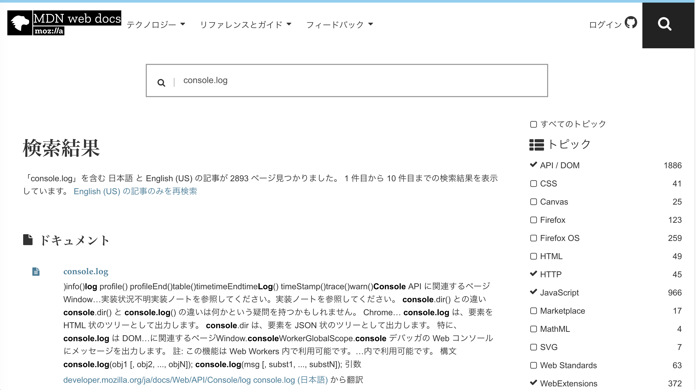
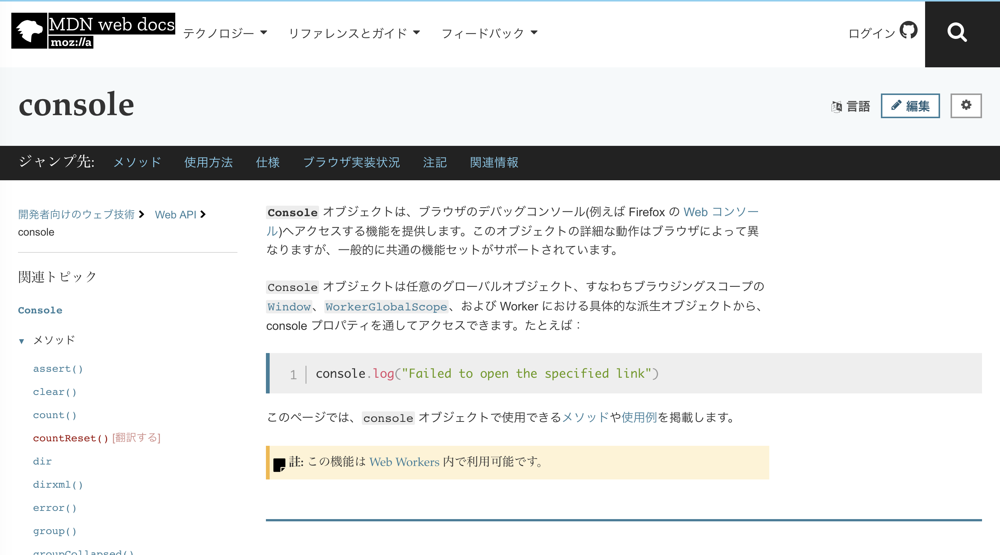

## 初心者に優しい技術記事の見分け方
@udayan28  
WeJS 2019/02/21

---

### 自己紹介

* イケてるエンジニアのための転職サービスを作っています@Findy
* UX Developer（なんでも屋？）
  * 開発（React, Rails）
  * 企画・仕様策定
  * リリースブログ・ユーザーインタビューetc
* 元ソシャゲプランナーʕº̫͡ºʔ

---

### 好きなもの
- 本と映画
- 最近おもしろかったもの
  - ズーランダー2（コメディ映画）
  - 世界神話辞典（各国の神話の起源とかがサクッと読める文庫）

---

### 話すこと、話さないこと
- 話すこと
  - 初心者に優しい技術記事について
- 話さないこと
  - JavaScriptについて（？？？）

---

### 先日こんな記事を見かけました
- 私たちはどうして公式ドキュメントが読めないのか？
- https://qiita.com/hiraike32/items/f0a211cceb0ecc516b6c

---

### 読んで思ったこと
- 「公式ドキュメント読め」はとても分かるし、中級以上のエンジニアは読んでる  |
- でも、初心者には無理じゃなかろうか？？？  |
- 当時の私には無理でした！！！（怒  |

--- 

### ここでいう初心者とは
下記のような人
- 入門書1冊 or Progate終わった
- フレームワーク入門終わった

---

### なぜ初心者は公式ドキュメントが読めないのか
- 探したい情報を探せない  |
- ドキュメントが整備されていない  |
- 英語わからない  |

---

### 探したい情報を探せない
- そもそも公式ドキュメントはどれ？？？
  - GitHub？
  - 日本語版？英語版？
- 公式ドキュメントごとに微妙に構造違って情報にたどりつけない
- 検索使おうにも知らないことは検索できない

---

### ドキュメントが整備されていない
- 更新が間に合っていない（和訳ドキュメントにありがち）
- 更新されていない（GitHubは更新されているのに・・・）
- ドキュメントがない or 各方面からドキュメントのポンコツさを指摘されているが直らない

---

### 英語わからない
- 英語で新しい概念を勉強するのそれなりにつらくないです？
  - 英語からは逃げられないが、初心者には酷なのでは・・・
- Google翻訳はあるが、結構きついｗ
  - ReactのState = 州 or 状態
  - 同じくProps = プロップ or 小道具

---

## じゃあ、初心者はどうするか・・・？

---

## 日本語の技術記事を読みますʕº̫͡ºʔ

---

## というわけで・・・

---

## 初心者に優しい技術記事の見分け方

--- 

### 技術記事を読むときの心構え
- 書いてあることが正しいかは自分で判断するしかない
- 新しい記事＝良いではないときもある
  - よくあるのが他の人のブログやQiitaをなぞっただけの記事・メモ
  - 古いものがそのまま使われていることもある(nodeだとndenvとか)
- できる限り正確である可能性が高いものを選ぶ
  - 公式ドキュメント
  - 書籍 or コミッターや業界で有名な人の技術ブログ
  - その他の技術記事

---

### 初心者に優しい技術記事とは
最低でも1つ、多い方が優しい（初心者が詰みにくい）
- 環境・バージョン等が書かれている
- 参考にした記事・ドキュメント等が書かれている
- ソースコード全体が公開されている

---

### 環境・バージョン等が書かれている
- 学習したいことに集中できる
- 書かれていないとどうなるか？
  - 初心者は環境構築だけでつまづく
  - ex. Aは入りません、そんなコマンドはない
    - ググって解決できなければ詰み

---

### 参考記事・ドキュメント等が書かれている
- 動かない等エラーが出たら、参考文献に飛べる
- 記載されていないとどうなるか？
  - 動かなかった瞬間にググり地獄が始まる
    - 適切な回答を見つけられなければ詰み

---

### ソースコード全体が公開されている
- 依存関係やソース全体が分かるため、変なエラーを産まない
- 細切れのソースコードだとどうなるか？
  - どこに書いていいのか迷う
  - そして、変なところに書いて詰む
  - 未記載のライブラリとか使われていると詰む

---

### この3つがあれば、詰む可能性が減らせる！
- 環境・バージョン等が書かれている
- 参考にした記事・ドキュメント等が書かれている
- ソースコード全体が公開されている

---

## やったね！

---

## ？

---

## 全然やってない

---

### 公式ドキュメントからは逃げられない
- 参考記事・書籍には、ほぼほぼ公式ドキュメントが出てくる
- 脱初心者には公式ドキュメントを読むのが必須
- 公式ドキュメント読めないと最新情報のキャッチアップができない

---

## じゃあ、どうするか？

---

## 公式ドキュメントに慣れよう！

---

### 公式ドキュメントに慣れるために
- まずは公式ドキュメントを見つけよう
- 良く使うメソッドを公式ドキュメントで探そう
- 色々なページを見てみよう

---

### まずは公式ドキュメントを見つけよう
- 正確なソースを知ることができる
- 分からなければ、知り合いに聞こう！

---

### 良く使うメソッドを公式ドキュメントで探そう
- 公式ドキュメント内で検索できるようになる
- 公式ドキュメントでメソッドの定義を読めるようになる

---

### onsole.logをMDN内で検索すると

---

### 色々なページを見てみよう
- 既知から未知へ
- ドキュメントの構造を知る

---

### console.logからconsoleオブジェクトのページへ

---

### 公式ドキュメントは慣れたら勝ち！

---

### まとめ
初心者に優しい技術記事とは
- 環境・バージョン等が書かれている
- 参考にした記事・ドキュメント等が書かれている
- ソースコード全体が公開されている

---

## 優しい技術記事から公式ドキュメントにステップアップ！

---

## ありがとう ございました！

